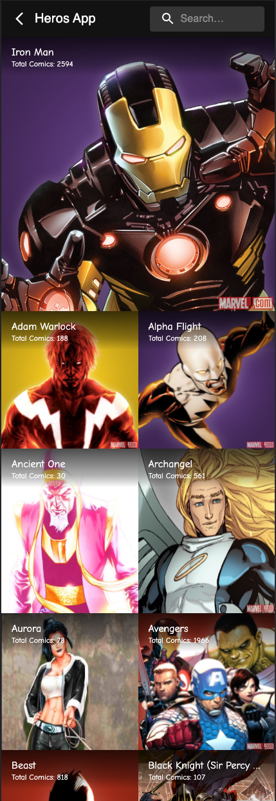

# Marvel Heros

> This app uses React and Redux, Along with React Router for data manipulation from a couple of web services. It is a SPA with the store object attached to the index.js component used by all of the components to make use and manupulate the data. The app contains data from the Marvel Developer API. Follows Javascript and CSS best practices. It renders information to the user on the main home page and passes the detail page with appropriate ID variable for the respective hero.

## Screenshots

## HomePage


## Details Page


## Search Function


## Built With

- Javascript
- HTML
- CSS
- React
- React Router Dom
- Redux

## Getting Started

To get a local copy up and running follow these simple example steps.

### Setup

Run

```bash
# To clone the git repositories
git clone https://github.com/uzairali19/metrics-webapp.git

# To install dependencies
npm install

# To run development branch
npm run start

# To build the project
npm run build

# To run tests on the project
npm run test
```

### Run tests

For Linters:

```bash
# To check for CSS errors
npx stylelint "**/*.{css,scss}"

# To check for Javascript errors
npx eslint .
```

## Authors

👤 **Uzair Ali**

- GitHub: [@uzairali19](https://github.com/uzairali19)
- Twitter: [@uzairali751](https://twitter.com/Uzairali751)
- LinkedIn: [Uzair Ali](https://www.linkedin.com/in/uzair-ali-9641/)

## 🤝 Contributing

Contributions, issues, and feature requests are welcome!

Feel free to check the [issues page](https://github.com/uzairali19/metrics-webapp/issues/).

## Show your support

Give a ⭐️ if you like this project!

## Acknowledgments

- Inspiration: [Nelson Sakwa on Behance](https://www.behance.net/sakwadesignstudio)

## 📝 License

This project is [MIT](./MIT.md) licensed.
